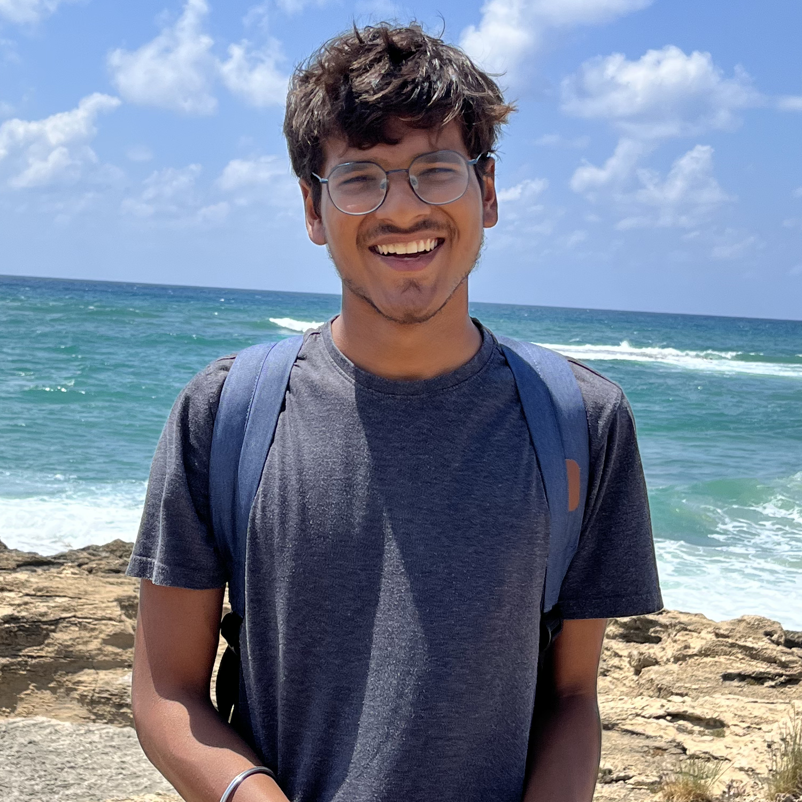

<!-- (comment) the image below can be found in img folder of this very project-->
{: style="float: right; margin: 0px 20px; width: 180px;" name="fox"}

I am Rachit, a PhD student at Harvard University. I am super fortunate to be advised by [Prof. David Alvarez-Melis](https://dmelis.github.io) and [Prof. Martin Wattenberg](https://www.bewitched.com/about.html). Broadly, I am interested in making language models more useful and controllable. I am also interested in understanding and analysis.
<!-- I am also interested in robust evaluation and analysis.-->

Over the past few years, I walked my first baby steps as a researcher owing to some wonderful people and collaborations. Most recently, I was a pre-doctoral researcher at Google DeepMind, working on modularizing LLMs with [Partha](https://parthatalukdar.github.io/) and [Prateek](https://www.prateekjain.org/). Before that, I pursued my bachelor's thesis research with [Yonatan](http://www.cs.technion.ac.il/~belinkov/) at the Technion in Israel. There I had a great time studying how [intrinsic properties of a neural network](https://rachitbansal.github.io/information-measures) are informative of generalization behaviours. Before that, I was a research intern at [Adobe](https://research.adobe.com/)'s Media and Data Science Research Lab, where I worked on [commonsense reasoning for large language models](https://aclanthology.org/2022.naacl-main.83/).

I was fortunate to collaborate with [Danish](https://www.cs.cmu.edu/~ddanish/) for more than two years to [evaluate explanation methods](https://direct.mit.edu/tacl/article/doi/10.1162/tacl_a_00465/110436/Evaluating-Explanations-How-Much-Do-Explanations) in NLP[^1]. I also had an amazing time working with [Naomi](https://nsaphra.net/) studying [mode connectivity in loss surfaces](https://openreview.net/forum?id=hY6M0JHl3uL) of language models[^2].

I also spent a couple of wonderful summers as a part of the Google Summer of Code program with the Cuneiform Digital Library Initiative ([CDLI](https://cdli.ucla.edu/)). Here, I was advised by [Jacob](https://www.wolfson.ox.ac.uk/person/jacob-dahl) and [Niko](https://www.english-linguistics.de/nschenk/).

## News and Timeline 
**2025**
* **May** Interning at Meta's Llama Pre-training team this Summer!

**2024**
* **August** Starting my doctorate at Harvard University!
* **May**  Presenting our work on composing large language models at ICLR 2024 in Vienna!

**2023**
* **May**  Presenting our work on linear mode connectivity at ICLR 2023 in Kigali!

**2022**
* **September**  My bachelor's thesis work done at the Technion was accepted at NeurIPS 2022!
* **August**  Joining [Google DeepMind](https://research.google/locations/india/) as a pre-doctoral researcher.
* **June**    Releasing the [pre-print](https://arxiv.org/abs/2205.12411) for our work on analyzing linear mode connectivity and out-of-distribution behaviour. Led by [Jeevesh](https://github.com/Jeevesh8) and mentored by [Naomi](http://nsaphra.github.io/).
* **May**     Two papers on commonsense and factual reasoning done at Adobe MDSR accepted at NAACL 2022!
* **January** Starting my bachelor's thesis with [Yonatan](http://www.cs.technion.ac.il/~belinkov/) at the Technion, Israel!

**2021**
* **November**  Our work evaluating model explanations is accepted at TACL! In collaboration with [Danish](https://www.cs.cmu.edu/~ddanish/).
* **July**    Attending the 11th Lisbon Machine Learning Summer School ([LXMLS 2021](http://lxmls.it.pt/2021/)).
<!-- * June 2021:    Volunteering at NAACL 2021. -->
* **May**     Work with CDLI accepted at ACL SRW 2021. Gauging machine translation and sequence labeling for extremely low-resource languages. 
* **May**     Starting as a Research Intern at Adobe’s Media and Data Science Research (MDSR).
<!-- * May 2021:     Volunteering at ICLR 2021. -->
<!-- * **February**  My first research paper accepted at PAKDD 2021. Detecting fake news early, with [Prof. Tanmoy Chakraborty](http://faculty.iiitd.ac.in/~tanmoy/) and [William Scott](https://www.linkedin.com/in/williamscottp/). -->

**2020**
* **November**  Started collaborating with [Danish](https://www.cs.cmu.edu/~ddanish/) (LTI, CMU) on evaluating neural explanations for NLP.
<!-- * Nov 2020:     Volunteering at EMNLP 2020. -->
* **June**    Contributing to the [Cuneiform Digital Library Initiative](https://cdli.ucla.edu/) (CDLI) as a part of [GSoC](https://summerofcode.withgoogle.com/)!
<!-- * June 2020:    Volunteering at ACL 2020. -->
<!-- * **May**     Joined [LCS2](http://lcs2.iiitd.edu.in/), IIIT-D as a Research Intern. Working on closed-domain misinformation detection across social networks. -->
<!-- * May 2019:     Serving as a Teaching Assistant for the Machine Learning course at Coding Blocks. With [Prateek](http://www.prateeknarang.com/) and [Manu](https://www.manuspillai.in/). -->

  

[^1]: Started with [a meek awe-inspired email](https://rachitbansal.github.io/img/danish-email.png)
[^2]: Started with [a message](https://rachitbansal.github.io/img/naomi-discord.jpeg) on [MLC](https://mlcollective.org/)'s Discord channel
